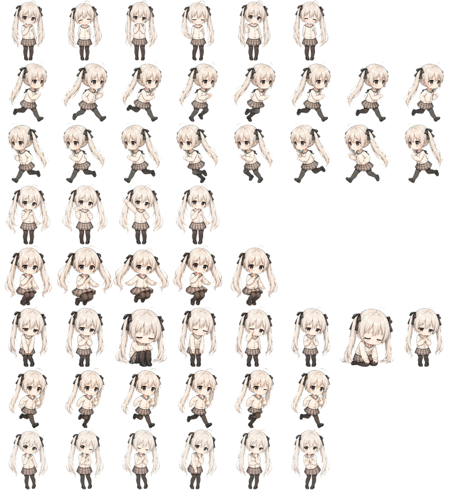

# Desktop Pet

一个可以在 Windows / macOS / Linux 上运行的通用桌宠模板。它使用 Electron 做透明置顶窗口，复用一张 8x8 的动画 spritesheet；当前仓库内置一套默认角色素材，以后可以按同样规格替换成其他角色。



## For Beginners

如果只是想下载后直接运行，请看 [小白使用说明.md](小白使用说明.md)。

## Features

- 透明、无边框、置顶小窗口
- 鼠标拖拽移动，拖动时自动播放移动动画
- 左键点击切换动作/表情
- 右键菜单切换：
  - 自动表情
  - 点击表情
  - 75% 到 200% 大小
  - 总在最前
  - 回到屏幕右下角
- 设置会自动保存到本机
- GitHub Actions 可在 Windows / macOS / Linux 上构建安装包

## Run Locally

```bash
npm install
npm start
```

## Validate

```bash
npm run check
```

## Build

```bash
npm run build
```

本地构建只能稳定生成当前系统对应的平台包。GitHub Actions 会分别在 Windows、macOS 和 Linux runner 上构建三端产物。

## Sprite Atlas

默认素材在：

```text
assets/sprites/default-character-sprite.png
```

规格：

- 8 列
- 8 行
- 单帧 768 x 832
- 整张图 6144 x 6656

行顺序：

1. idle
2. runningRight
3. runningLeft
4. waving
5. jumping
6. failed
7. running
8. review

换角色时，只要保持同样的 atlas 规格，就可以直接替换 PNG。

## License

Code is released under the MIT License. See [ASSET_NOTICE.md](ASSET_NOTICE.md) before publicly redistributing artwork assets.
